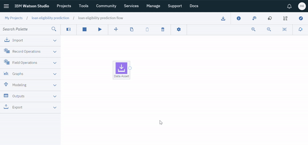
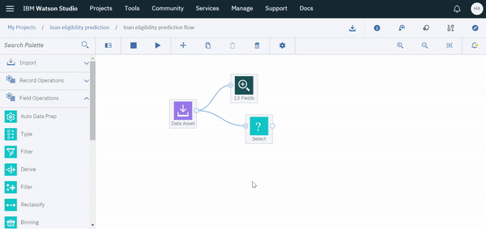
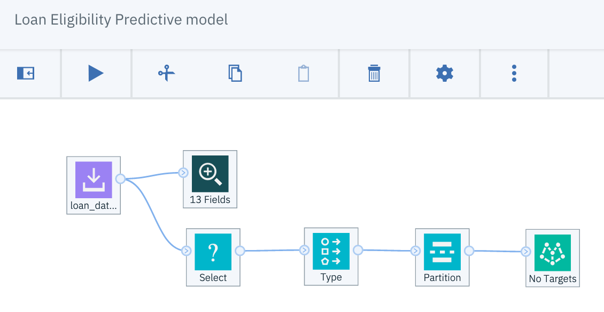

# Predict Loan Eligibility Using IBM Watson Studio

Loans are the core business of loan companies. The main profit comes directly from the loan’s interest. The loan companies grant a loan after an intensive process of verification and validation. However, they still don’t have assurance if the applicant is able to repay the loan with no difficulties.

In this workshop, we’ll build a predictive model to predict if an applicant is able to repay the lending company or not. We will prepare the data using Jupyter Notebook and then build the model using SPSS Modeler.

The instructions were adapted from https://developer.ibm.com/tutorials/predict-loan-eligibility-using-jupyter-notebook-ibm-spss-modeler/. 


## Objective

After completing this tutorial, you’ll understand how to:

- Add and prepare your data
- Build a machine learning model
- Save the model


## Tools Used

- Watson Studio [(docs)](https://dataplatform.cloud.ibm.com/docs/content/wsj/getting-started/welcome-main.html?audience=wdp)
- Watson Machine Learning [(docs)](https://developer.ibm.com/clouddataservices/docs/ibm-watson-machine-learning/get-started/)


## Requirements

In order to complete this tutorial, you will need the following:

- [IBM Cloud Account](https://cloud.ibm.com)
- Object Storage Service.
- Watson Studio Service.
- Machine Learning Service.


## Review Dataset

The dataset is from [Analytics Vidhya](https://datahack.analyticsvidhya.com/contest/practice-problem-loan-prediction-iii/#data_dictionary).

The format of the data:
- Variable Description
- Loan_ID Unique Loan ID
- Gender Male/ Female
- Married Applicant married (Y/N)
- Dependents Number of dependents
- Education Applicant Education (Graduate/ Under Graduate)
- Self_Employed Self employed (Y/N)
- ApplicantIncome Applicant income
- CoapplicantIncome Coapplicant income
- LoanAmount Loan amount in thousands
- Loan_Amount_Term Term of loan in months
- Credit_History Credit history meets guidelines
- Property_Area Urban/ Semi Urban/ Rural
- Loan_Status Loan approved (Y/N)


## Workshop Flow

Complete the steps below to develop, create, deploy and test the model while interacts with SPSS modeler in IBM Cloud.


### 1. Cloud the Repo

1. Open a terminal window.

1. Clone this repository. Execute command

    ```
    $ cd  ~

    $ git clone https://github.com/lee-zhg/spss-predict-loan-eligibility.git

    $ cd  spss-predict-loan-eligibility
    ```


### 2. Create a Watson Studio Project

1. Open Watson Studio by logging in at [https://dataplatform.ibm.com](https://dataplatform.ibm.com)

1. From the Watson Studio home page, click on `Create a project`.

1. Select `Create an empty project` as the type of project to create.

1. Give your project a name, for example `SPSS model proj`.

    

1. Click `Create` as you already have an Object Storage instance associated with your project.


### 3. Upload the Dataset to Watson Studio

1. Click the `Assets` tab near the top of the window.

1. Click on `Add to project` near the top of the window.

1. Select `Data`. 

1. `Find and add data` window is opened on the top right.

    

1. Click on `browse`. Locate and select file data/loan_dataset.csv which can be found 

1. After the dataset is uploaded into `Watson Studio`, you should find it under `Data assets`in the `Assets` tab.

    


### 4. Associate an instance of the Watson Machine Learning service  with your Watson Studio Project

1. Select the `Settings` tab in your project

    

1. Select a `Machine Learning` instance.
   - Scroll down to the `Associated services` section. 
   - Click on `Add Service`.
   - Select `Watson` and then 
   - Click the `Add` link in the `Machine Learning` tile.

1. Select an existing `Machine Learning` instance.
   - Click on the `Existing` tab if it is enabled.
   - Select your existing instance from the drop down. 
   - Click `Select`.

1. Your  `Machine Learning` instance is associated with your project.

    


### 5. Create SPSS Modeler Flow

1. Click on `Add to project` near the top of the window.

1. Select `Modeler flow`. 

    

1. Assign an unique name, for example, "Loan Eligibility Predictive model".

1. Select `Modeler Flow` as the `flow type`.

1. Select `IBM SPSS Modeler` as `Runtime`.

    

1. `Create`.


### 6. Create SPSS Model

Now, you are ready to create SPSS model.


#### Step 1. Add and Prepare Data

1. Expand the `Import` section in the `Palette` pane on the left.

    

1. Drag and drop the `Data Asset` node to the canvas on the right.

1. Double click on the node and click Change Data Asset to open the Asset Browser on the right. 

    

1. Expand the `Data assets` in the left pane.

1. Select `loan_dataset.csv` under the `Data assets` section.

    

1. Click `OK` and then `Save`.


#### Step 2. Review Data

`Data Audit` node can be used to review data before creating the model.

1. Expand the `Outputs` section in the `Palette` pane on the left.

    

1. While the `loan_dataset.csv` Data Asset node is selected, double click on `Data Audit` to add it to the canvas.

1. The link between the two nodes is added automatically.

    

1. Double click on the new `Data Audit` node to open its property window on the right.

    

1. Select the `Use custom fields` check box.

1. Click the `Add Columns` link.

1. Select all fields.

1. Click `OK`.

    

1. Click `Save` to save the changes to the `Data Audit` node.

1.  Right click the `Data Audit` node and select `Run`.

1. After a few seconds, the running result appears in the right pane.

    

1. Double click on the running result of the `Data Audit` node to review.

    


#### Step 3. Filter Data

While reviewing the running result of the `Data Audit` node, we observe that some columns have missing values. Let’s remove the rows that have null values using the `Select` node.

1. Click the `Loan Eligibility Predictive model` (or your unique name of the modler flow) on the top.

    

2. Expand the `Record Operations` section in the `Palette` pane on the left.

    

3. While the `loan_dataset.csv` Data Asset node is selected, double click on `Select` to add it to the canvas.

4. The link between the `Select` node and `loan_dataset.csv` Data Asset node is added automatically.

    

>> Note, if `Select` node and `Data Audit` node overlay each other, use mouse to move one node or both.

5. Double click on the new `Select` node to open its property window on the right.

    

6. Select `Discard` mode.

7. In the `Condition` field, copy the following condition to remove rows with null values.

    ```
    (@NULL(Gender) or @NULL(Married) or @NULL(Dependents) or @NULL(Self_Employed) or @NULL(LoanAmount) or @NULL(Loan_Amount_Term) or @NULL(Credit_History))
    ```

8. `Save`.

Data is clean now, and we can proceed with building the model.


#### Step 4. Define Input and Output Fields

1. Expand the `Field Operations` section in the `Palette` pane on the left.

    

1. Drag and drop the `Type` node to the canvas.

1. Connect the `Select` node and `Type` node by using your mouse.

    

1. Double click the `Type` node or right click to open it.

1. Choose Configure Types to `Read Metadata` under the `Default Mode`.

    

1. Select `Clear All Values` button to clear all fields.

1. Select `Read Values` button to populate fields from metadata in the dataset.

    >> Node, without these two steps, you won't get desired result.

1. Make sure that the `Role` of field `Loan_Status` is `Target`.

1. Make sure that the Role of the field `LoanID` is `Record ID`.

    

1. Click `Save`.


#### Step 5. Split Dataset

1. Expand the `Field Operations` section in the `Palette` pane on the left.

    

1. Drag and drop the `Partition` node to the canvas.

1. Connect the `Partition` node and `Select` node.

    

1. Double click the `Partition` node or right click to open it.

1. Set the  `Training Partition(%)` to 80.

1. Set the `Testing Partition(%)` to 20.

    

1. `Save`.


#### Step 6. Choose and Build Model

Loan eligibility has two possible outvome - either Y:Yes or N:No. Thus, the choice of algorithms fell into `Bayesian` networks since it’s known to give good results for predicting classification problems.

1. Expand the `Modeling` section in the `Palette` pane on the left.

    

1. Drag and drop the `Bayes Net` node to the canvas.

1. Connect the `Bayes Net` node and `Partition` node.

    

1. Double click the `Bayes Net` node or right click to open it.

1. Select `Use custom field roles` check box.

1. Select `Loan_Status` as the `Target`.

1. Select `Add Columns`.

1. Select all the remaining attributes as input except `Partition` and `Loan_ID`. 

    

1. When you finish, click `Save`.

1. Right click the `Bayes Net` node, then select `Run`. In a few seconds, a model is created in an orange colored node.

Right click on the orange colored node, then click on `View Model`.
Now you can see the Network Graph and other model information here.

#### Step 7. View Model

1. Right click on the orange-colored model node, then select on `View Model`.

1. Now you can see the Network Graph and other model information here.

    


#### Step 8. Evaluate Model Performance

1. Expand the `Outputs` section in the `Palette` pane on the left.

    

1. Drag and drop the `Analysis` node to the canvas.

1. Connect the orange-colored model node and `Analysis` node.

    

1. Right click the `Analysis` node and select `Run`.

1. Analysis result appears in the right pane after a few seconds.

    

1. Double click on the Analysis result to view it.
    

1. Evaluate model performance. The analysis report shows we have achieved 82.3% accuracy on our test data set with this model. 

1. Optionally, you can build more models within the same canvas until you get the result you are satisfied.


#### Step 9. Save Model

1. Right-click on the `Bayes Net` node and select `Save branch as a model`. 

1. Enter a name for the model. A machine learning service should be added automatically if you already associated one. 

    

1. Click `Save`.

1. In the `Asset` tab, you can find your saved model under `Watson Machine Learning models`. It can be deployed from there.

    


## Summary

In this tutorial, you learned how to create a complete predictive model without coding, from importing the data, preparing the data, to training and saving the model. You also learned how to use SPSS Modeler and export the model to Watson Machine Learning models.


## Related Links

There is lots of great information, tutorials, articles, etc on the [IBM Developer site](https://developer.ibm.com) as well as broader web. Here are a subset of good examples related to data understanding, visualization and processing:

- [Build ML Model for Loan Eligibility using Modeler](https://developer.ibm.com/tutorials/predict-loan-eligibility-using-jupyter-notebook-ibm-spss-modeler/)
- [Build ML Model to predict Chuurn](https://developer.ibm.com/patterns/predict-customer-churn-using-watson-studio-and-jupyter-notebooks/)
- [Predict Fraud with Skewed Data](https://developer.ibm.com/patterns/predicting-fraud-using-skewed-data/)
- [XGBoost Model on Client Purchases](https://developer.ibm.com/patterns/analyze-bank-marketing-data-using-xgboost-gain-insights-client-purchases/)
- [ML Model on Medical Data](https://developer.ibm.com/patterns/analyze-open-medical-data-sets-to-gain-insights/)


## General Links

- [IBM Developer](https://developer.ibm.com)
- [Watson Studio](https://dataplatform.ibm.com/)
- [Watson Studio Overview](https://dataplatform.cloud.ibm.com/docs/content/wsj/getting-started/overview-ws.html?audience=wdp&context=wdp&linkInPage=true)
- [Watson Machine Learning Python SDK](https://wml-api-pyclient.mybluemix.net/)
- [Watson Studio Video Learning Center](https://www.youtube.com/playlist?list=PLzpeuWUENMK3u3j_hffhNZX3-Jkht3N6V)
- [Data Science Code Patterns](https://developer.ibm.com/code/technologies/data-science/)
